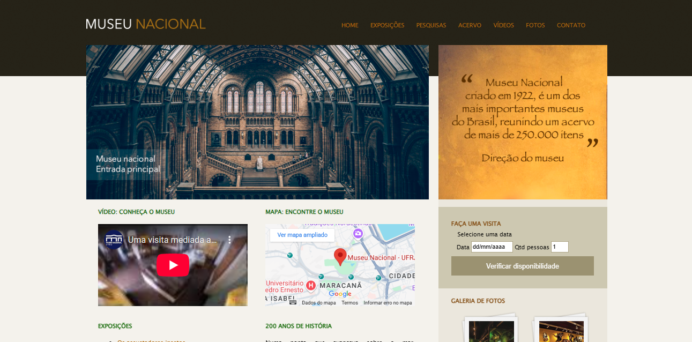

# microprojeto-css-MuseuNacional

Este é um projeto simples de um site para o Museu Nacional, desenvolvido utilizando HTML e CSS. O objetivo é criar uma interface visualmente agradável e funcional para apresentar informações sobre o museu, incluindo exposições, vídeos, galeria de fotos e informações de contato.


---

## Estrutura do Projeto
---
A estrutura do projeto é organizada da seguinte forma:


### Arquivos Principais
---
- **`index.html`**: Contém a estrutura HTML principal do site.
- **`css/estilo.css`**: Estilos personalizados para o site.
- **`css/normalize.css`**: Reseta estilos padrão dos navegadores para garantir consistência.
- **`img/`**: Contém as imagens utilizadas no site, como o logotipo, fundo e imagens da galeria.

## Funcionalidades
---
- **Página inicial**: Apresenta o logotipo, barra de navegação e seções principais.
- **Galeria de fotos**: Exibe imagens relacionadas ao museu.
- **Vídeo e mapa**: Integra um vídeo do YouTube e um mapa do Google Maps.
- **Formulário de visita**: Permite selecionar uma data e quantidade de pessoas para agendar uma visita.
- **Rodapé**: Links rápidos para navegação e informações de direitos autorais.

## Tecnologias Utilizadas
---
- **HTML5**: Para a estrutura do site.
- **CSS3**: Para estilização e layout.
- **Normalize.css**: Para padronizar estilos entre navegadores.

## Como Executar o Projeto
---
1. Clone este repositório:
   ```bash
   git clone <URL_DO_REPOSITORIO>

2. Abra o arquivo index.html em qualquer navegador.

### Melhorias Futuras
---
Tornar o site responsivo para dispositivos móveis.
Adicionar mais interatividade com JavaScript.
Implementar um sistema de backend para gerenciar agendamentos de visitas.

### Créditos
---
Este projeto foi desenvolvido com base no aprendizado adquirido no curso Desenvolvimento Web Completo da Udemy, ministrado pelo professor Jamilton Damasceno.

Agradecimentos ao professor pela abordagem didática e prática que tornou possível a criação deste projeto, além de incentivar o desenvolvimento de habilidades em frontend.